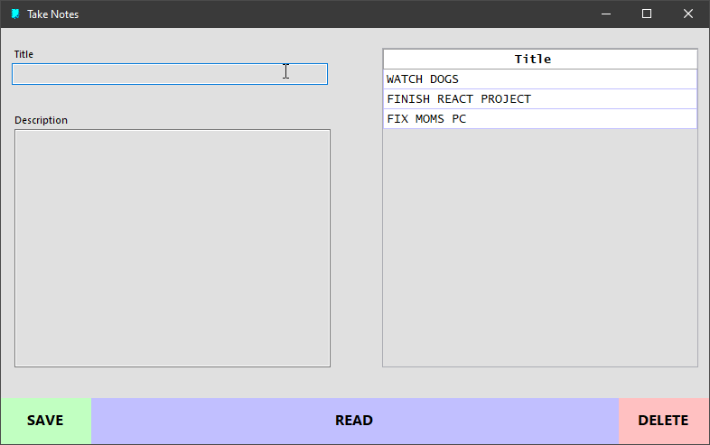

# Take Notes 🤓

This is project is a part of my **C# Marathon** I am doing 15 C# projects 😋 using some instructions given in [this blog](https://dev.to/nerdjfpb/15-c-project-ideas-beginner-to-expert-with-tutorial-iio). This blog has given out 15 C# Projects ideas to fallow and improve skills 🦾

This is the second C# Application I selected from those 15.

## This a C# WinForms personal application - Take Notes 🤓

There are several types of _Take Notes_ applications around the world (better ones 🙂). This is a very basic type of that kind

### Use Case

IT poeople 😎 usually forget their other jobs like _home stuff_ and _take care of loved ones_ 😐 This application helps to keep notes as reminders while working **in** the computer 😮

The user can insert notes when the user turns on the computer first time and check the notes periodically to know if the user should be missing something other than computer... 🤗

### Special Features of this App 😁

- Data view and data source bind 🤔
- Responsive design

Notes are saved into a `Data Table`. This table has a `Data Table View` control which views the data table as the name suggests. When the data table is updated, view also updates.

There is only one window and it is responsive. There is a minimum size but not maximum size 😀

### This application can be more improved in this way, but I do not have much time ☹

- Double click on a table row to view it
- Notes can be saved into a database and should be vanished with in a day or user can decide _the auto vanishing time period_ ⏰
